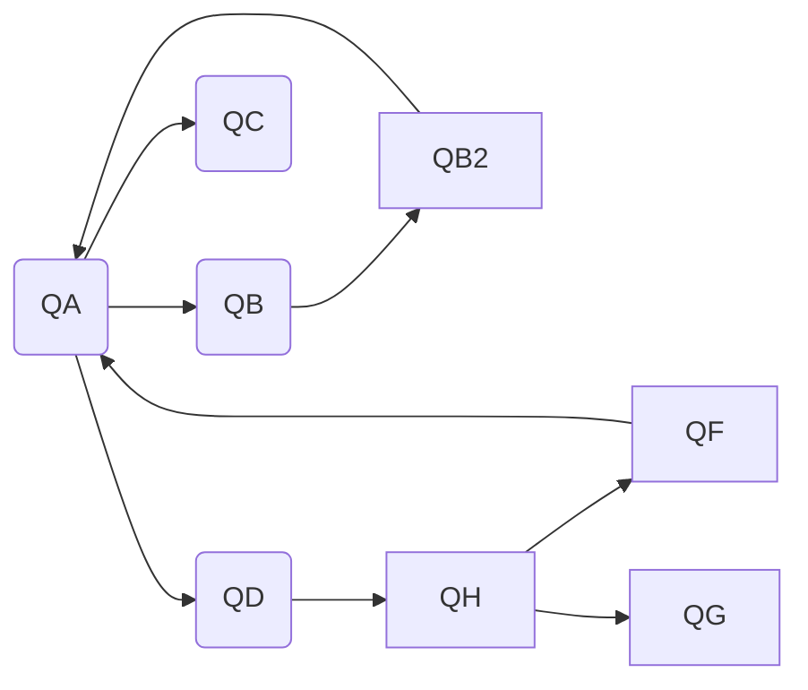
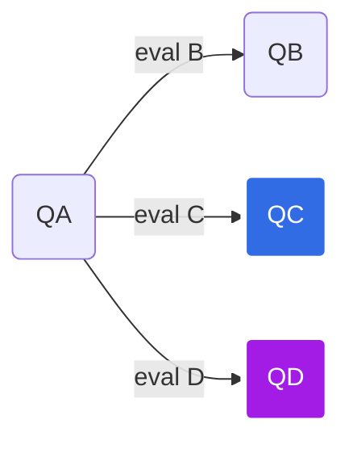
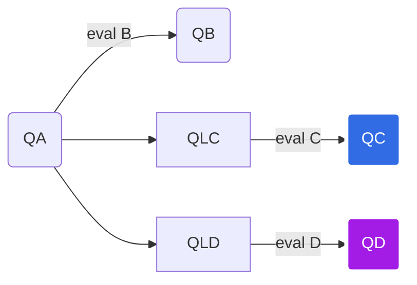

## Exchanges stack

The included Exchanges stack supports the definition of Exchange queues with the following configuration parameters:

* Exchanges are defined as one or several configurations specifying one source queue and one or several exchange destinations
* Each exchange source `src` is defined by a queue namespace `ns` and a queue name  `queue`
* Exchange destination `dst` is defined as an array of objects defined by a namespace `ns`, a queue name `queue` and an (optional) evaluation function `selector`, this function will indicate, with it's execution result, if a particular message should be passed to the exchange destination queue
* An additional `max_hoop` safeguard parameter may be set as a limit for the maximum number of hoops that a message in an exchange may perform to avoid having loops in the definition that may end saturating the queues.
For example, giving this configuration:

Messages flowing from QA may return to the source due to the exchanges from `QB2` and `QF`, so processing a set of messages in `QA` may cause an exponential growth of the number of messages in the same queue.

### Selector Evaluation

The selector evaluation is performed over the source queue by:

* Extracting one message from the source queue
* If a selector is defined for a particular destination, the message is passed as argument to the selector defined for each destination queue. If the result is true, the message is passed to the correspondent destination queue

Notice that the evaluation of the different destination queues selectors is performed in a synchronous loop, in which the evaluation order is defined by the exchange configuration definition order. Once a message is reserved from the source, it is passed to the exchange evaluation loop, and each of the selectors receives the message in its current state. That means that as the message is passed to the selectors, they can change its values (or add other properties, for the case) so the next evaluated selectors in the configuration will receive this altered copy of the original message (and may choose to pass it to their destinations, with the altered values).

### Exchange Stats

Exchange execution will also report statistics about the queues execution and evaluation times

### Use case: Distributed Exchanges (queues on different servers)

Source and destination queues may be on different namespaces/BBDD (which means that some destination endpoint may be unreachable due to network or temporal issues). In that case, since the exchange is synchronous and not transactional, you may end up with problems due to duplicate messages arriving to queues on the same server of the source queue, or missing messages that fails to reach remote queue servers.
Lets see an example:

In this schema, both `QC` and `QD` are queues defined in different servers, so, when a message arrives to `QA`, the exchange may propagate it to `QB` (which is in the same server), `QC` (in a remote server) and `QD` (in a different remote server), depending on the result of their eval function.
Since the exchange is synchronous, once a message is pulled from the source and commited into the first target, it will not be rolled back if the rest of the nodes fail to push it also, so, if `QC` and `QD` are having temporal issues, the message may be lost for them.
We can try to change eval functions to take this into account and re-insert the message into the source queue, but doing so may cause the message to be duplicated for `QB`, unless we start adding changes in our eval code to add meaningfull state info to the message before inserting it back in the source code. This may end up adding a big over-complexity in the eval functions, which is not desirable at all. Instead, we can have a much-simpler way of dealing with this kind of configuration by adding some intermediate queues:

`QLC` and `QLD` here are queues in the same server as `QA`, and merely act as a temporal stage before trying to exchange with the remote servers `QC` and `QD`. This way, the exchange is not blocked in case the remote servers presents any  temporal issue.
